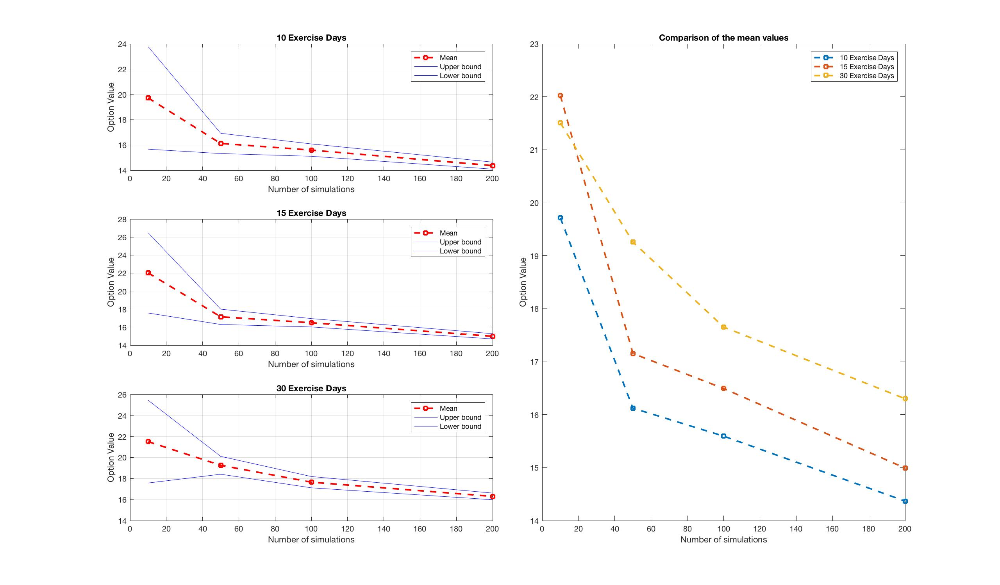

# Pricing a Bermudan Call Option on best-of-basket Stocks

Authors: Antoine Gex-Fabry, Cedric Mueller, Ludovic Tuchschmid

Semester exercise for a lecture in Computational Finance at the University of St. Gallen. 

The goal is to price a Bermudan Basket Option with Longstaff-Schwarz method.

Longstaff, Francis A., and Eduardo S. Schwartz. "Valuing American options by simulation: a simple least-squares approach." The review of financial studies 14.1 (2001): 113-147.

## Instructions

### Technique 

To price such an option, we use Monte Carlo simulations and, therefore, a backward recursion. The idea is to compute the holding value of a stock at each time, and to compare this price with an early exercise payoff. The holding values are estimated using linear regression of the two best performing and in-the-money stock stock prices on the discounted cash-flows.

Please see the instructions file PDF for the complete statement of this exercise.

### Functions

General functions:
  * `CorrelatedBrownian.m`: generates correlated geometric brownian motions.

Specific functions:

These functions are minimalist (often only a few lines) but allow for a better clarity by splitting the tasks in multiple sections. 
  * `find_most_performing.m`: finds the two most performing assets from the current period. 
  * `in_the_money.m`: for the best performing stock, returns the two best performing stock positions that are in the money in the previous period. 
  * `compare_strategy.m`: compare the holding value and the early exercise values and store the adequate values. 
  * `clean_cash_flow.m`: cleans the cash_flows to have only 1 element by row (as there can't be more than one cash flow by simulation). 
  
Pricing function: 
  * `BasketBermudeanCall.m`: takes all the parameters and, by using the above functions, runs the procedure to price such an option by using the Longstaff-Schwarz method. 
  
### Running the pricing procedure

You can play with parameters and run the pricing using the `PricingTest.m`. This script also produces graphs. 

